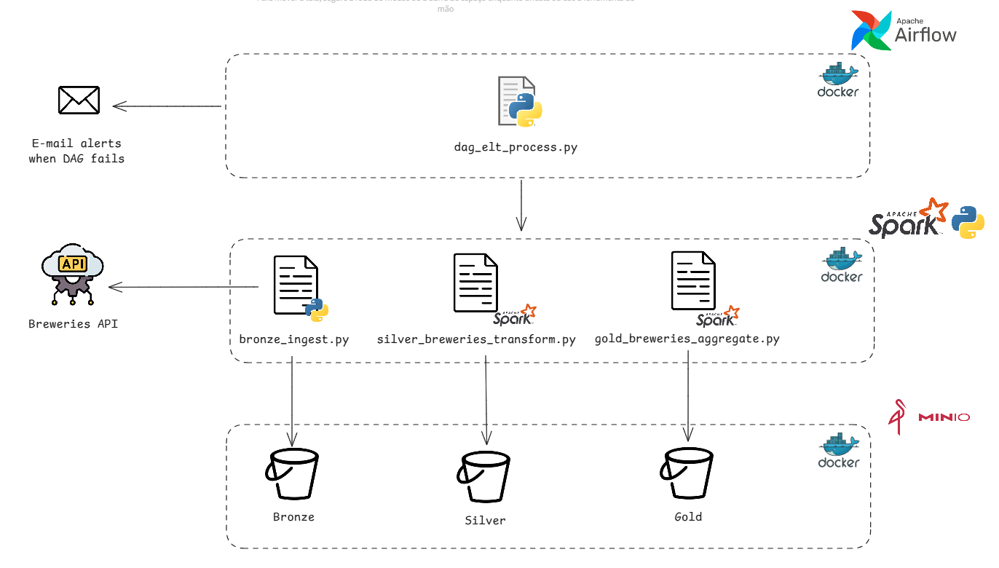

# Breweries project (Airflow + Spark + MinIO)

This repository contains a **local, containerized data platform** that ingests public data from the **Open Brewery DB** API and builds **Bronze → Silver → Gold** layers on **MinIO** (S3-compatible).  
All orchestration is done with **Apache Airflow**, processing with **Apache Spark**, and ad‑hoc analysis with **JupyterLab**.

## Architecture (high level)



Airflow runs the three tasks in order: **bronze → silver → gold**.

---

## Medallion architecture

- **Bronze (raw):** JSON pages exactly as received from the API, **partitioned by** `ingestion_date=YYYY-MM-DD`
- **Silver (clean):** curated **Parquet** data (trimmed types, normalized location), **partitioned by** `country`, `state` and also by `ingestion_date`
- **Gold (analytics):** **Delta Lake** table with aggregated metrics (e.g., breweries by country/state), **partitioned by** `ingestion_date`

**Tech stack:** Docker, Docker Compose, Airflow, Spark, MinIO (S3), Delta Lake, JupyterLab.

---


## Prerequisites

- **Docker** and **Docker Compose** installed
- Open ports: `8080` (Airflow), `9000-9001` (MinIO), `8888` (Jupyter), `9090` (Spark UI)
- Minimum hardware:
    - CPU: 4 cores
    - RAM: 12 GB (16 GB recommended)

---

## Quick start

1) **Clone the repository**

```bash
git clone https://github.com/<your-user>/bees-breweries-docker.git
cd bees-breweries-docker
```

2) **Create your env file**

If there is a sample, copy it; otherwise create `config.env` and paste minimal settings:
```bash
cp config-example.env config.env    # if the example exists
# or create config.env from scratch
```

3) **Create the shared Docker network**

```bash
docker network create project-net
```

4) **Start the services (MinIO → Spark → Airflow)**

```bash
# MinIO
docker compose -f minio/docker-compose.minio.yaml --env-file ./config.env up -d --build

# Spark (includes Spark Master/Workers and JupyterLab service)
docker compose -f spark/docker-compose.spark.yaml --env-file ./config.env up -d --build

# Airflow (webserver, scheduler, worker, triggerer)
docker compose -f airflow/docker-compose.airflow.yaml --env-file ./config.env up -d --build
```

5) **Open the UIs**

- Airflow:      http://localhost:8080
- MinIO Console: http://localhost:9001
- JupyterLab:   http://localhost:8888/lab
- Spark Master UI: http://localhost:9090

6) **Run the pipeline**

- In Airflow, find and unpause the DAG: **`breweries_elt_pipeline`**
- Trigger it manually (or set a schedule if you prefer)
- The three tasks will run in sequence:
    - `bronze_land_raw` → lands `s3a://bronze/breweries/ingestion_date=.../page=N.json`
    - `silver_build`   → writes curated Parquet under `s3a://silver/breweries/ingestion_date=.../`
    - `gold_build`     → writes Delta table under `s3a://gold/breweries_agg/ingestion_date=.../`

7) **Explore with Jupyter**

- In Jupyter, open: `work/breweries_minio_analysis.ipynb`
- The notebook shows how to connect Spark to MinIO (`s3a://`), read all layers, and plot quick insights.

---

## Project layout

```
.
├─ airflow/
│  ├─ Dockerfile
│  ├─ docker-compose.airflow.yaml
│  └─ dags/
│     ├─ dag_elt_process.py                     # Airflow DAG (bronze→silver→gold + optional alerts)
│     └─ scripts/
│        └─ bronze_ingest.py                    # Bronze ingestion (requests → MinIO JSON)
│
├─ spark/
│  ├─ Dockerfile
│  ├─ docker-compose.spark.yaml                 # Spark Master/Workers + JupyterLab
│  ├─ jobs/
│  │  ├─ silver-layer/
│  │  │  └─ silver_breweries_transform.py       # cleans + Parquet partitioned by country/state
│  │  └─ gold-layer/
│  │     └─ gold_breweries_aggregate.py         # aggregates → Delta Lake (breweries_agg)
│  └─ notebooks/
│     └─ breweries_minio_analysis.ipynb         # ad-hoc analysis
│
├─ minio/
│  └─ docker-compose.minio.yaml
│
├─ config.env                                   # your environment settings (not committed)
└─ .gitignore
```

---

## Useful commands

**Stop services**
```bash
docker compose --env-file ./config.env -f airflow/docker-compose.airflow.yaml down
docker compose --env-file ./config.env -f spark/docker-compose.spark.yaml down
docker compose --env-file ./config.env -f minio/docker-compose.minio.yaml down

```

**Restart after code changes**
```bash
# (Often enough) just restart Airflow services:
docker compose --env-file ./config.env -f airflow/docker-compose.airflow.yaml up -d --build

# If you changed Spark Dockerfile or jars:
docker compose --env-file ./config.env -f spark/docker-compose.spark.yaml up -d --build
```

**Clean volumes (careful: wipes data!)**
```bash
docker compose --env-file ./config.env -f airflow/docker-compose.airflow.yaml down -v
docker compose --env-file ./config.env -f spark/docker-compose.spark.yaml down -v
docker compose --env-file ./config.env -f minio/docker-compose.minio.yaml down -v

```

---
